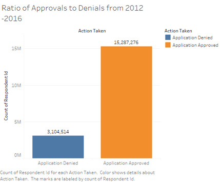
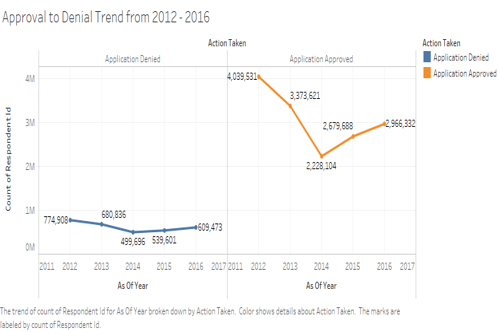
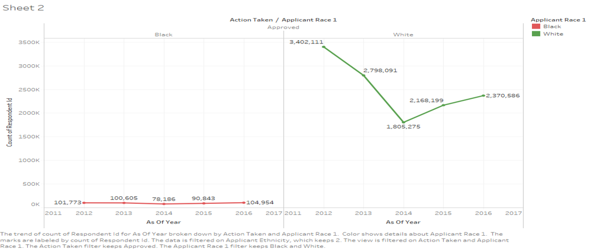
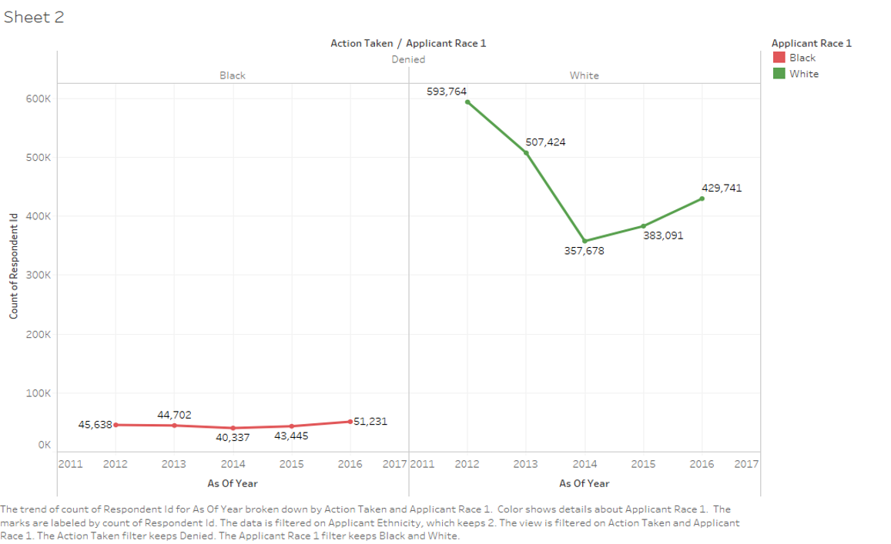

# Assessment of Minorities Access to Finance  
## About This Project

Abstract – Access to finance is a fundamental aspect of an individual’s social and economic growth. By applying data mining techniques (exploratory and predictive analytics) to the Home Mortgage Disclosure Act data spanning a decade (from 2007 to 2016), insight is gained on the major determinants for mortgage approval or denial and how it has affected minorities over the past decade.

	Index Terms – Visualization, Machine Learning, Neural Network, Decision Trees, Data Mining.

I.  INTRODUCTION
	“The American Dream” is a phrase that transcends time in the American society; giving the average man and woman a goal to work towards. For some it still remains the idea of having that house that you can finally call your home, with a “white picket fence”, and for others, the idea has evolved. Whatever the attainable, encapsulated in that dream, the constant themes are the need for socio-economic stability, success and freedom. Yet they can only be achieved through sufficient and unbiased Access to Finance. 
In recent times, the following questions have become prevalent in public discussion forums; 
1.	If things have changed in the United States, why are there still few minority owned business?
2.	Why do fewer minorities the homes they live in?
3.	Why is there a stagnant growth of minorities in the STEM fields and college as a whole?
4.	Why are there few minority owned financial institutions (Commercial Banks, Community Banks, and Micro-Lenders).
5.	Why do minorities get higher interest rates on loans?

The list goes on. Yet to understand the issues with minorities in the United States, you cannot do so without talking about the issues African American have faced and continue to face in the United States. Hence, most of the references of the term “minorities” in this paper will be mostly referring to African-Americans.

.  METHODOLOGY
A.	Data Collection and Preprocessing
	The 2007 to 2016 data which is about 100 gigabytes was downloaded in two parts from the Consumer Financial Protection Bureau.  Through the CFPB API, the public has the option of downloading the data with or without the data codes, but not without the actual value names. As such, the data came with labels as well. Hence, because of the size of the data, only the first five thousand rows were read in initially. This process made it easier to determine with columns contained character labels and which contained the label codes. 

Using the column index, only the desired variables ("action_taken", "agency_code", "applicant_ethnicity", "applicant_income_000s", "applicant_race_1", "applicant_sex", "as_of_year", "co_applicant_ethnicity", "co_applicant_race_1", "co_applicant_sex", "hoepa_status", "lien_status", "loan_purpose", "msamd", "preapproval", "purchaser_type", "respondent_id, "state_code", "hud_median_family_income", "loan_amount_000s", "number_of_1_to_4_family_units",  "number_of_owner_occupied_units", "minority_population", "population", "tract_to_msamd_income"
) 
were finally read into R for preprocessing.  

Since all the variables were imported as character class instead of numeric class, all the variables/features except for the “respondent_id” were converted to numeric class.  Doing this resulted in the replacement of the blank row entries to be replaced with the missing “NA” values. Consequently, the next step in the preprocessing phase was the removal of all rows that contained at least one “NA” value. Next in the “action_taken”, out of the existing eight possible entries:
 
1 -- Loan originated 
2 -- Application approved but not accepted 
3 -- Application denied by financial institution 
4 -- Application withdrawn by applicant 
5 -- File closed for incompleteness 
6 -- Loan purchased by the institution 
7 -- Preapproval request denied by financial institution 
8 -- Preapproval request approved but not accepted

The only actions relevant to this study are: 1-- Loan originated, which is a way of saying that the loan was approved by the institution and accepted by the applicant; 2 -- Application approved but not accepted; 3 -- Application denied by financial institution.

The application approved but not accepted, represented by code 2, is replaced to code 1, thus ensuring that all loan approvals have the same identifier. While the application denied by financial institution, represented by code 3 is replaced with code 0. This ensures that all models will require “Binary Classification”. Lastly, a new subset of the data is collected, with the condition that all rows are selected where the “action_taken” variable has a value of either 0 or 1. 

The processed data was then exported as a comma-separated values (csv) file for the exploratory visualization in Tableau.
B.	The Story Within the Data
       Having exported the data as a csv file, it is then imported into Tableau. And as in any good visualization, the visuals must provide answers to clearly defined questions. Since the recession occurred in 2009, the primary focus of the exploratory analysis will be on the data from 2012 to 2016.
       
#### Note: All Visualizations were done in Tableau
 
Question 1: What is the overall ratio of loan approvals to denials from 2012 to 2016?

Question 2: Has there been a consistent increase in the loan approvals from 2012 to 2016?

Question 3: What is the trend in approvals and denials by race from 2012 to 2016?

